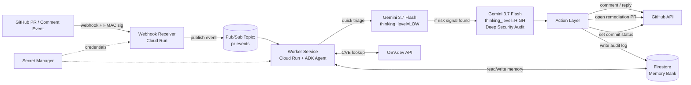

# GitSentry — Stateful AI Security Co-Pilot for GitHub
### All Things Agentic Hackathon — Collaborative Partner Track

GitSentry is a stateful, autonomous security co-pilot for GitHub. Unlike stateless scanners that drop isolated comments, GitSentry remembers architectural decisions and individual developer habits across pull requests, performs two-tier deep threat audits using **Gemini 3.7 Flash**, and autonomously opens remediation pull requests while gating merges with commit status checks.

---

## 🏗️ System Architecture



### Why Decoupled Webhook Ingestion Matters:
GitHub webhooks require an HTTP response in under ~10 seconds. Gemini reasoning, dependency vulnerability lookups (OSV.dev), and multi-turn state retrieval can take longer under peak load. The **Webhook Receiver** verifies the `X-Hub-Signature-256` HMAC header, normalizes the event payload, immediately publishes to the Google Cloud Pub/Sub topic `pr-events`, and returns HTTP 200 within milliseconds. The **Worker** processes events asynchronously without risk of duplicate GitHub webhook retries or dropped events.

---

## 🏆 Hackathon Compliance & Stack Matrix

| Mandate Requirement | Tech Choice | Notes |
|---|---|---|
| **Model Engine** | Gemini 3.7 Flash via Vertex AI / Google AI Studio | Two effort tiers via `thinking_level` (`LOW` for fast triage, `HIGH` for deep security audits). Single model, dual-tier cost and latency control. |
| **Agent Framework** | Google ADK / Python Agent Layer | State machine, tool calling (OSV.dev, Firestore Memory Bank, GitHub API), RAG retrieval. |
| **GCP Infrastructure** | Cloud Run + Pub/Sub + Firestore + Secret Manager | 4 distinct GCP services: Pub/Sub event decoupling, Firestore memory collections, Cloud Run serverless compute, Secret Manager runtime mounting. |
| **Secrets & Security** | Google Secret Manager + HMAC-SHA256 | `GITHUB_APP_PRIVATE_KEY`, `GITHUB_WEBHOOK_SECRET`, `GEMINI_API_KEY` loaded at runtime with TTL caching. Zero secrets committed or baked into container layers. |

---

## ⚖️ Judging Alignment

| Criterion | Weight | How GitSentry Delivers |
|---|---|---|
| **Innovation & Operational Utility** | 40% | Auto-opens remediation PRs, auto-blocks merges via commit status (`gitsentry/security`) until risk is resolved or explicitly overridden with an approved justification. Not just a comment bot — a real security gate. |
| **Architectural Discipline & Tech Stack** | 30% | Pub/Sub decouples ingestion from processing; Secret Manager + GitHub App + constant-time HMAC verification; two-tier Gemini thinking for cost control; graceful fallback degradation on malformed outputs. |
| **Demo & Production Readiness** | 30% | Comprehensive 3-PR live scenario exercising `decisions`, `dev_habits`, and autonomous remediation; fully containerized for Cloud Run; multi-stage Docker build; 100% test coverage on webhook security and event normalization. |

---

## 🧠 Firestore Memory Bank Schema

```
projects/{repo_id}/decisions/{decision_id}
    - description: string          e.g. "Staging env allows unauthenticated /health route"
    - approved_by: string
    - pr_reference: string
    - created_at: timestamp
    - status: "active" | "superseded"

projects/{repo_id}/dev_habits/{author_id}
    - pattern: string              e.g. "raw SQL string concatenation instead of parameterized queries"
    - occurrences: array<pr_reference>
    - first_seen: timestamp
    - last_seen: timestamp

projects/{repo_id}/audit_log/{event_id}
    - pr_reference: string
    - action_taken: string          e.g. "opened remediation PR #47", "blocked merge", "cleared status"
    - reasoning_summary: string
    - timestamp: timestamp
```

---

## 🚀 Quickstart & Local Setup

### 1. Prerequisites
- Python 3.11+
- Google Cloud SDK (`gcloud`)
- GitHub App with permissions:
  - **Repository permissions**:
    - Pull requests: Read & write
    - Issues: Read & write
    - Commit statuses: Read & write
    - Contents: Read & write (to create remediation branches and PRs)
  - **Subscribe to events**: `Pull request`, `Issue comment`

### 2. Environment Configuration
Copy `.env.example` to `.env` and fill in your values:

```bash
cp .env.example .env
```

### 3. Install Dependencies
```bash
pip install -r requirements-dev.txt
```

### 4. Run the Webhook Receiver Locally
```bash
uvicorn services.receiver.app:app --host 0.0.0.0 --port 8000 --reload
```

### 5. Send Simulated GitHub Events
Use the built-in test utility to send signed events:

```bash
# Ping event
python scripts/test_webhook.py --event ping

# Pull request opened event
python scripts/test_webhook.py --event pull_request --action opened

# Pull request comment event
python scripts/test_webhook.py --event issue_comment --action created

# Test security rejection (deliberately invalid HMAC)
python scripts/test_webhook.py --event pull_request --invalid-signature
```

---

## 🧪 Running the Test Suite

Run unit and integration tests with coverage:

```bash
pytest -v --cov=common --cov=services/receiver tests/
```

---

## ☁️ Google Cloud Deployment

Deploy the Webhook Receiver to Google Cloud Run:

```bash
export GCP_PROJECT_ID="your-gcp-project-id"
export GCP_REGION="us-central1"
chmod +x scripts/deploy_receiver.sh
./scripts/deploy_receiver.sh
```

---

## 🛡️ Non-Functional Guarantees

1. **Credential Security**: GitHub App tokens generated on-the-fly; HMAC-SHA256 signature verification on every incoming byte before parsing; Google Secret Manager for all keys.
2. **Decoupling**: Webhook receiver returns HTTP 200 in <100ms; Pub/Sub retains events if worker undergoes rolling update or scaling.
3. **Cost Control**: Gemini 3.7 Flash triage pass (`thinking_level=LOW`) screens trivial PRs before triggering deep audit (`thinking_level=HIGH`).
4. **Scope Discipline**: GitSentry opens remediation PRs and blocks merges, but **never merges code itself** — human engineers retain final merge authority.
