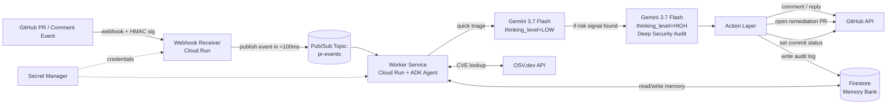

# GitSentry: Submission Write-Up
### All Things Agentic Hackathon — Collaborative Partner Track

---

## 🎯 Executive Summary

**GitSentry** is a stateful, collaborative AI security co-pilot for GitHub built on **Gemini 3.7 Flash** and **Google Cloud Platform**. Unlike stateless scanners that drop noisy, isolated comments on pull requests and forget context immediately, GitSentry:

1. **Remembers architectural decisions** across pull requests using a persistent **Firestore Memory Bank** with automatic compaction.
2. **Autonomously remediates high-confidence vulnerabilities** by creating branches and opening linked remediation PRs while enforcing merge-blocking commit status checks (`gitsentry/security`).
3. **Adapts to individual developer habits** over time, tracking recurring anti-patterns and coaching developers constructively across their pull requests.
4. **Conducts Socratic multi-turn dialogue** on PR comments, pushing back on thin justifications and recording substantiated overrides directly into institutional memory.

---

## 🏗️ System Architecture



### Architectural Highlights & Decoupling
- **Webhook Ingestion SLA**: GitHub requires webhook responses in under 10 seconds. The FastAPI Webhook Receiver verifies HMAC signatures, normalizes payloads, and publishes to Google Cloud Pub/Sub (`pr-events`) in `<100ms`, returning HTTP 200 immediately.
- **Asynchronous Worker Processing**: The worker handles Gemini reasoning, OSV.dev lookups, and GitHub mutations asynchronously without risk of dropped events or duplicate webhook retries.
- **Security & Secret Management**: All credentials (`GITHUB_APP_PRIVATE_KEY`, `GITHUB_WEBHOOK_SECRET`, `GEMINI_API_KEY`) are fetched dynamically from **Google Secret Manager** with TTL in-memory caching. Zero secrets are committed or baked into container images.
- **Dual-Tier Gemini Calling**: Triage runs at `thinking_level=LOW` to screen trivial changes, while deep audits run at `thinking_level=HIGH` with memory context injection.

---

## 🏆 Hackathon Compliance & Stack Matrix

| Mandate Requirement | Tech Choice | Implementation Details |
|---|---|---|
| **Model Engine** | Gemini 3.7 Flash | Two effort tiers via `thinking_level` (`LOW` for fast triage, `HIGH` for deep audits). Single model, dual-tier cost and latency control. |
| **Agent Framework** | Google ADK / Python Agent Layer | State machine, tool calls (OSV.dev API, Firestore Memory Bank, GitHub API), RAG retrieval. |
| **GCP Services (4 Services)** | Cloud Run + Pub/Sub + Firestore + Secret Manager | Decoupled event bus (`Pub/Sub`), persistent memory collections (`Firestore`), serverless auto-scaling compute (`Cloud Run`), runtime credential resolution (`Secret Manager`). |
| **Vulnerability Data** | OSV.dev API (Google Open Source Vulnerabilities) | Dependency manifest parsing (`requirements.txt`, `package.json`) and real-time CVE lookup against `api.osv.dev/v1/query`. |

---

## ⚖️ Judging Rubric Alignment

| Criterion | Weight | How GitSentry Hits It |
|---|---|---|
| **Innovation & Operational Utility** | 40% | Auto-opens remediation PRs for single-file findings (`confidence >= 0.85`), blocks merges via commit status checks (`gitsentry/security`) until resolved, and conducts multi-turn Socratic pushback on weak developer override justifications. |
| **Architectural Discipline & Tech Stack** | 30% | Decoupled Pub/Sub event bus; constant-time HMAC verification; Secret Manager integration with TTL caching; Memory Compactor bounding Gemini prompt token size as repos grow; comprehensive test suite (126 tests). |
| **Demo & Production Readiness** | 30% | 3-beat live demo scenario exercising every Firestore collection (`decisions`, `dev_habits`, `audit_log`, `memory_briefs`); multi-stage Docker build; automated end-to-end demo simulator. |

---

## 🧠 Firestore Memory Bank Schema

```
projects/{repo_id}/decisions/{decision_id}
    - description: string          e.g. "Staging allows unauthenticated /health route"
    - approved_by: string
    - pr_reference: string
    - created_at: timestamp
    - status: "active" | "superseded"

projects/{repo_id}/dev_habits/{author_id}
    - pattern: string              e.g. "raw SQL string concatenation instead of parameterized queries"
    - occurrences: array<pr_reference>
    - first_seen: timestamp
    - last_seen: timestamp

projects/{repo_id}/audit_log/{event_id}
    - pr_reference: string
    - action_taken: string          e.g. "opened remediation PR #101", "blocked merge", "cleared status"
    - reasoning_summary: string
    - timestamp: timestamp

projects/{repo_id}/memory_briefs/latest
    - decisions_summary: string    e.g. "1 active decision(s): Staging allows unauthenticated /health..."
    - habits_summary: string       e.g. "1 tracked pattern(s): raw SQL (2 occurrences)..."
    - total_decisions: int
    - total_habits: int
```

### Memory Compaction
Raw `decisions` and `dev_habits` documents get summarized into a condensed per-repo `MemoryBrief` once the collection exceeds a threshold (`MEMORY_COMPACTION_THRESHOLD`). This brief is what gets injected into Gemini's system prompt, keeping prompt tokens strictly bounded regardless of repository history length.

---

## 🛡️ Safety Boundaries

- **GitSentry opens PRs and blocks merges — it NEVER merges code itself.**
- Final merge decisions always require human authorization.
- Lower-confidence (`confidence < 0.85`) or multi-file findings fall back to Markdown suggestions rather than unvetted PRs.

---

## 📈 Learnings & Future Enhancements

1. **Stateful vs. Stateless AI Review**: Giving an AI agent cross-PR memory and developer-specific habit tracking transforms developer sentiment from "annoying noisy bot" to "constructive pair programmer."
2. **Socratic Pushback**: Requiring structured justification for security exemptions dramatically reduces false override approvals and automatically builds documented compliance records.
3. **Future Roadmap**: IDE sidecar extension to surface developer habits in real-time before commits are pushed; automatic CI lint rule generation based on recurring team patterns.
